# Creating Database and API

This documentation is a supplement to the YouTube Video on how to create a Database on Azure and an API on ASP.NET Core. If you are confident with your ability to code, feel free to watch the video in 2x speed or just read the documentation by itself. :)

### Contents
1. Before you start
2. Model
3. Base
4. Enabling Sqlite, Seeding Data, & Migrations
5. CRUD + Swagger
6. LINQ
7. Adding Azure Blob Storage
8. Deploying to Azure
9. CORS Warning/Error


## 1. Before you start 

There are a few items you will need to have prior to commencing this tutorial.

* Visual Studio Community 2017
    * When installing ensure ASP.NET Core and web development is selected      
* Azure Account with active subscription (You can just sign up for a new account for subscription)
* .NET Core 2.1 SDK or later
* Postman
* <a href="https://docs.microsoft.com/en-us/cli/azure/install-azure-cli?view=azure-cli-latest">Azure command line (CLI)</a>
* <a href="https://dotnet.microsoft.com/download/visual-studio-sdks">DOTNET Core 2.2</a>
* Don't forget to restart your computer after you've installed all the softwares


## 1.1 Context

For the sake of this tutorial, we will be making a school management system that allows the user to create/read/update/delete student information. 

## 2. Model

Before we even start to write a line of code, we need to think about what we would like to store in our database and what properties we want our API to return. This is crucial because the cost of modifying an existing database is very high.

In phase 1 we will only focus on creating one table, keep an eye out on phase 2 for more exciting stuff such as database normalisation concepts and relational models!
 
<!-- We need to then explicitly define this. Generally speaking there are some common properties such as ID, which present in all Models.  -->
 
 In this example, we would like to store some details of the student. Ask yourself, what basic information would we need to store from a student?

 We will be storing the following information, feel free to add/delete fields as you see fit.

 * Id
 * First Name
 * Last Name
 * Phone Number
 * Email Address
 * DOB (Date of birth)
 * Date Created

 Aside from field names, we also need to consider their types. For example, it is normal to store *id* as integers, but it doesn't make sense to only allow numbers to be stored in the *name* fields. 
 
There are many data types available in SQL, the ones we will be using are:
 * VARCHAR
 * INT
 * DATE

 >You can read more about data types on 
 https://www.w3schools.com/sql/sql_datatypes.asp

 After we confirm on what we need to store, we shall model this out. 

 <br/>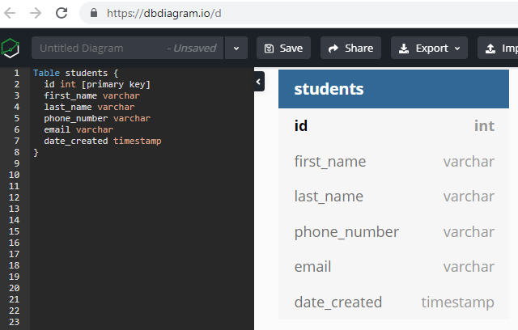

---
**NOTE**

This diagram may look redundant/hollow as of now because there is only one table, but creating the diagram before you code will really benefit you when you have many relational models which would get heinously complicated very quickly.

---

Noticed how the fields have the same naming convention? Each word is separated with underscore. Having the same naming convention would add consistency throughout the database.

## 3. Azure SQL Database
Now that we have finished planning for the database, we can actually create it on Azure portal!

Make sure you have an active subscription, navigate to https://portal.azure.com on your browser and search for a new service resource called "SQL databases"
 <br/>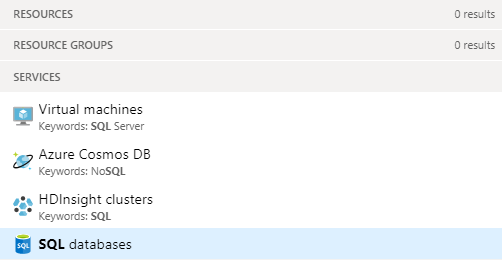

 Then click on Add then follow the structure below
  <br/>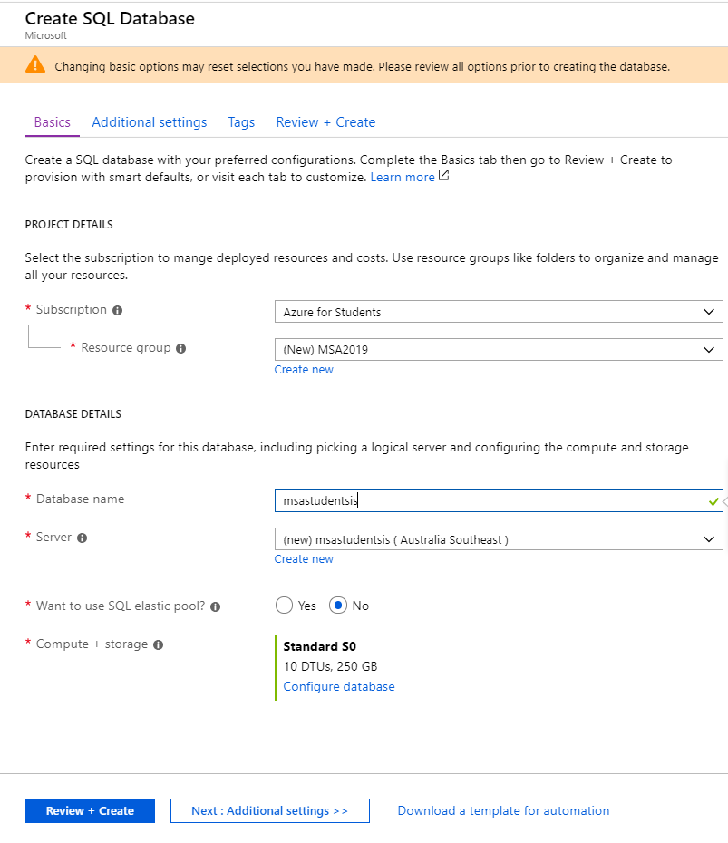

  When you are creating a new server, choose a sensible server name and note down your database admin login and password, we will need to use it later. Choose Australis Southeast Location as it is physically closest to us.
  <br/>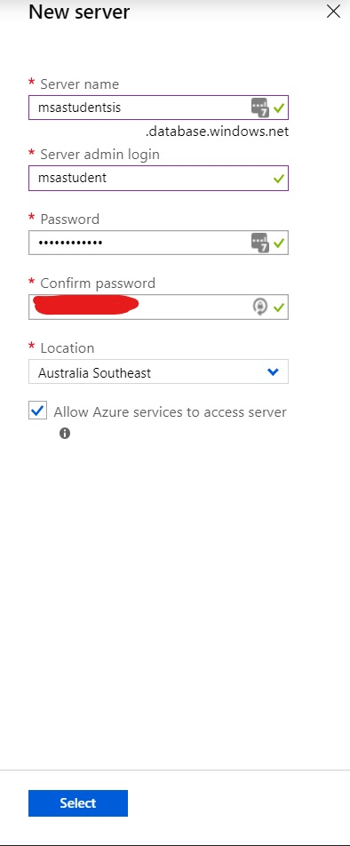

  When it comes to choosing Compute + storage, select the free/cheapest option
  <br/>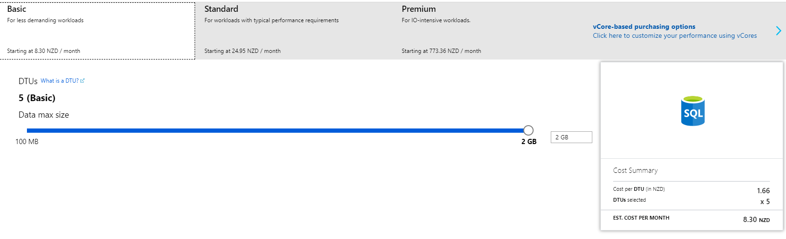

  When you are done, click on Review + create then your deployment should be underway!

  In about 2 minutes, you should see the following notification
  <br/>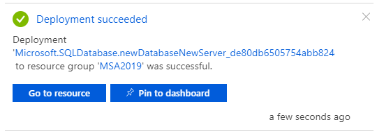

  Now that the database is created, we shall create the table we've designed earlier in the database. Click on your new SQL Database resource
  <br/>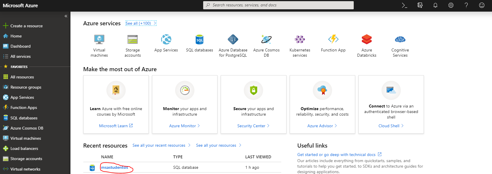

  From the tool bar on the left, choose Query Editor.
  <br/>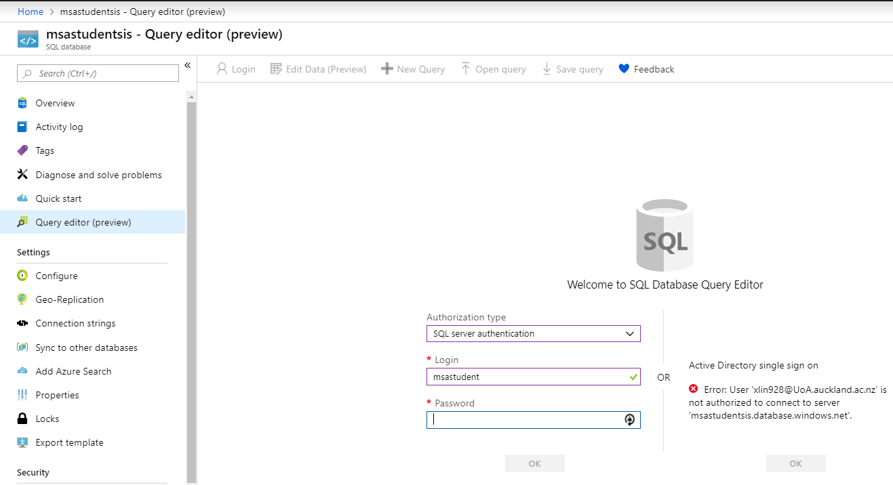
  
  Remember your database admin login and password? Pop those in.

  We are now going to use standard SQL statement to create a new table (notice how similar this SQL statement is compared to the design we did on dbDiagram?):
  ```
    CREATE TABLE [students]
    (
        id INT NOT NULL IDENTITY(1, 1) PRIMARY KEY,
        first_name VARCHAR(50),
        last_name VARCHAR(50),
        phone_number VARCHAR(20),
        email VARCHAR(50),
        dob DATE,
        date_created DATE
    );
  ```

  Hit the Run button then you should see the following message:
  <br/>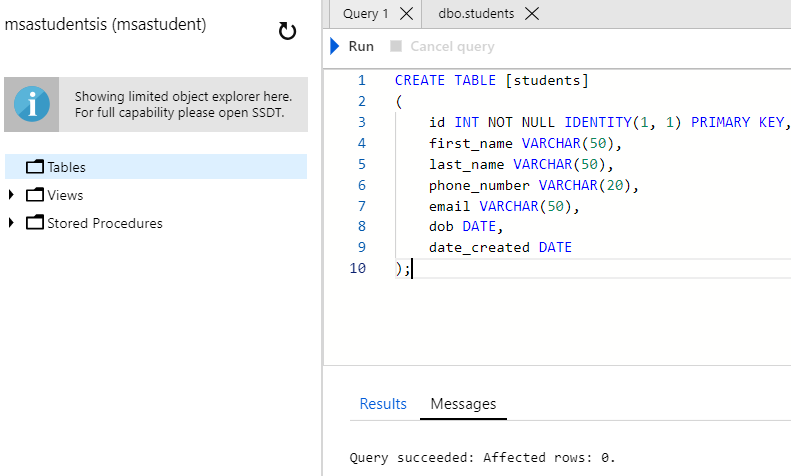

  Our database is basically done. We just need to do two more things to allow us to access the database from anywhere.

  Go back to Overview and hit "Set server firewall"
  <br/>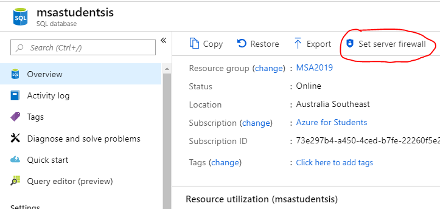
  Add the following firewall rule to enable access to the database from any IP address.
  <br/>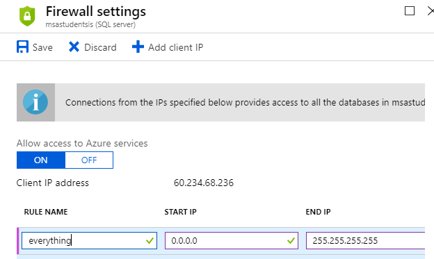
  Then hit Save.

  One more thing. 
  Choose Connection Strings from the toolbar and copy ADO.NET connection string, we will use this to scaffold the database when we are creating the API.
  <br/>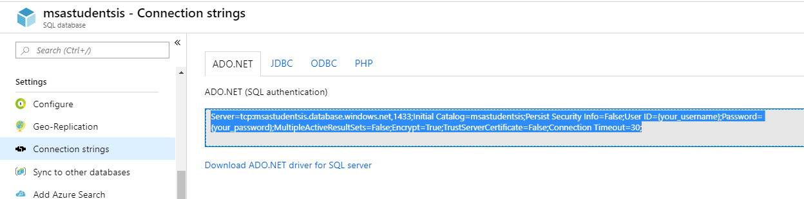

  Now we are ready to go to the next phase.

  ## 4. Create the API using .NET Core

  ### Creating the base project
  Open Visual Studio -> New Project -> Web -> .Net Core -> ASP.NET Core Web Application. 
  <br/>Make sure you tick add to source control.

  <br/>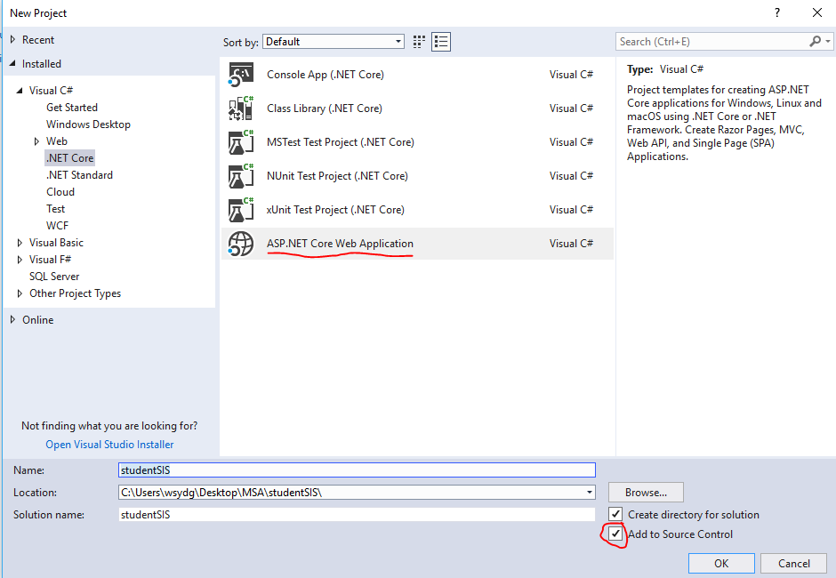

  Select API and make sure your .Net Core version is 2.2
  If you only see ASP.NET COre 2.1, download the ASP.NET Core 2.2 SDK as suggested in the beginning of the documentation.

  <br/>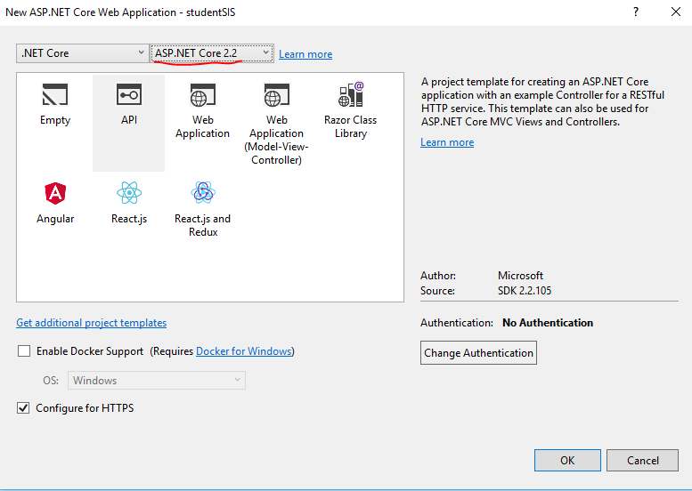

  Once you hit OK, your project should be created. We now need to install a few dependencies so we can work with our SQL Server Database.
  Navigate to the search bar on the top right and search for "NuGet" then select manage NuGet package

  <br/>

  Click on Browse and search for
  ``` Microsoft.EntityFrameworkCore.SqlServer ```

  <br/>

  Hit install then do the same for  ``` Microsoft.EntityFrameworkCore.Design ```

  We have everything we need to work with the database, now we can "Scaffold" the database.
  # Insert explaination for Scaffold
  Open up Package Manager Console. (If you can't find it, remember to use the search bar on the top right) 
  ```
  Scaffold-DbContext "YOURCONNECTIONSTRING" Microsoft.EntityFrameworkCore.SqlServer -OutputDir Model -Context "schoolSISContext" -DataAnnotations
  ```
  Replace **YOURCONNECTIONSTRING** to the connection string you've retrieved from Azure.<br/>
  Paste the code in the console and execute it.

  In the Solution Explorer, you can see that there are two files being created through the scaffold command.
  
  ```schoolSISContext.cs``` represents a session with the underlying database. You can read more on <a href="https://docs.microsoft.com/en-us/dotnet/api/system.data.entity.dbcontext?view=entity-framework-6.2.0">DbContext Class</a>

  ```Students.cs``` is the class created from the design of the database table, think of it like the blueprint for a student object. Whenever we create a student, it will have those fields/variables listed in the Students class.

  We now have the blueprint for a student, we can use this blueprint to create a controller so we can interact with the database with HTTP requests. <a href="https://docs.microsoft.com/en-us/aspnet/web-api/overview/getting-started-with-aspnet-web-api/tutorial-your-first-web-api#adding-a-controller">Read more about controllers here</a>

  Right click on controllers from the Solution Explorer - ```Add - New Scaffold item...```

  <br/>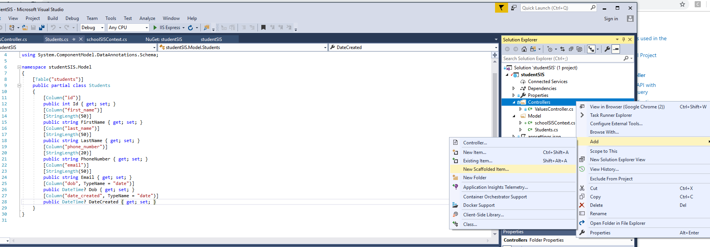

  Choose ```API Controller with actions, using Entity Framework```
  <br/>

  Choose Students in Model class, schoolSISContext as Data context class and controller name should be auto completed.
  <br/>

  Hit add and wait for Visual Studio to do its magic.

  Once done, you should notice the new file ```StudentsControllers.cs```
  This controller allows us to Create/Read/Update/Delete (This is called CRUD, the four basic functions of persistent storage) students from the database.

  The API is almost done! Now we need to change the connection string so we can access the database with our credentials on Azure.<br/>
  Open ```appsettings.json``` from the Solution Explorer and change the value of the context key to your connection string you've retrieved from Azure.
  ```
  {
    "Logging": {
        "LogLevel": {
        "Default": "Warning"
        }
    },
    "AllowedHosts": "*",
    "ConnectionStrings": {
        "schoolSISContext" : "YOURCONNECTIONSTRING"
    }
  }
  ```

  With that last change, Go ahead and start the API application with IIS Express in the tool bar. 
  <br/></br>
  Once IIS Express launches a browser, change the path from /values to /Students
  <br/><br/>
  **Voilà, this is your first API!** This is not very exciting right now as there is no content stored in the database, but if you are able to see this, believe it or not, you've just created a fully functional API.

  In order for us to interact with the API, we can use <a href="https://www.getpostman.com/">Postman</a> to make HTTPS requests, but that's boring and abstract when we are just starting out creating API. In order to have a visual representation of the API, let's install <a href="https://swagger.io/">Swagger</a>

  > Swagger helps developers design, build, document, and consume RESTful Web services.

  Open Manage NuGet packages from Visual studio as before, go to Browser and search for `Swashbuckle.AspNetCore` and hit install.
  <br/><br/>

  Then add the following code to the bottom of the ConfigureServices method in ``Startup.cs``:

  ```
    // Register the Swagger generator, defining 1 or more Swagger documents
    services.AddSwaggerGen(c =>
    {
        c.SwaggerDoc("v1", new Info { Title = "SchoolSIS", Version = "v1" });
    });
  ```

  Next add the following to the ``Configure`` method in ``startup.cs`` file.

  ```
    // Enable middleware to serve generated Swagger as a JSON endpoint.
    app.UseSwagger();

    // Enable middleware to serve swagger-ui (HTML, JS, CSS, etc.), 
    // specifying the Swagger JSON endpoint.
    app.UseSwaggerUI(c =>
    {
        c.SwaggerEndpoint("/swagger/v1/swagger.json", "School SIS API V1");
        c.RoutePrefix = string.Empty; // launch swagger from root
    });
  ```
  Now your ``startup.cs`` file should look like this
  <br/><br/>

  The last step before seeing an Swagger UI for the API is to edit the launch path.
  Go to Properties in the Solution Explorer and open `launchSettings.json`.
  Change all occurrences of 
  ```
   "launchUrl": "api/Values"
  ```
  to 
  ```
   "launchUrl": ""
  ```
  This will open up Swagger UI when we launch our project.
  
  Everything is ready. Launch the project again to see your new Swagger UI!


  

  


---
TO BE WORKED ON
```
CREATE TABLE [students]
(
    id INT NOT NULL IDENTITY(1, 1) PRIMARY KEY,
    first_name VARCHAR(50),
    last_name VARCHAR(50),
    phone_number VARCHAR(20),
    email VARCHAR(50),
    dob DATE,
    date_created DATE
);
```
 

 meme which is being uploaded. Things such as the image title, its URL, any tags (to group similar memes together), the uploaded date and time, and its width and height. Your project may or may not require all these fields or may even need additional ones.

 This can be visualised as the following json:

 ```
    {
        "Id": 1,
        "Title": "Is Mayonnaise an Instrument?",
        "Url": "https://example.com/url-to-meme-img.jpg",
        "Tags": "Spongebob",
        "Uploaded": "11/10/2018 10:09:52 PM",
        "Width": "680",
        "Height": "680"
    }
 ```

 We'll be using this model later in the tutorial.

 ## 3. Base

### Creating the base project

Open Visual Studio -> New Project -> Web -> .Net Core -> ASP.NET Core Web Application.
 
 Give your project a name, and note the location its being created at.

<br/>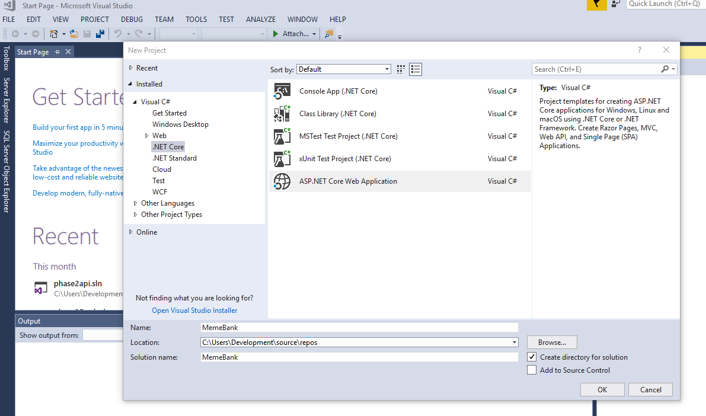
 

 Select API and press OK

<br/>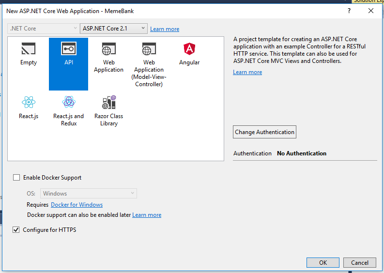

 After its finished creating the project, your solution explorer should look something like:

 <br/>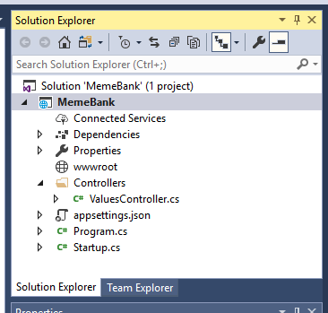

 Let's go ahead and run this. Note: you'll likely get this message pop up
  <br/>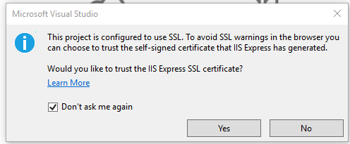
  Because earlier we selected HTTPS, its configured to use SSL, and so we need to trust the self-signed cert for this to work. Select "Dont ask me again" and press Yes, and Yes again.

 A internet browser should have launched and it should display: 
 ```
 ["value1","value2"]
 ```

 Congrats! You've just created your first API. But all it does is return those two items. Let's go ahead and make it a bit more dynamic.

 Let's first delete the file ValuesController.cs in the Controllers folder. We don't need this.

 Remember in the last section we talked about Models? We now need to add this as code to help our database. The above Model is quite simple so is quite easy to convert into a C# class, but there can be times where converting it can either be complex or time consuming (if you've already got the json object.) In this case we can use an online service such as json2csharp.com to convert json to a c# class.
  
 Go to the website, enter in the json, and press Generate. This will create a pojo which we can copy.

  * Back in Visual Studio, right click the Project  Add -> New Folder. 
  <br/>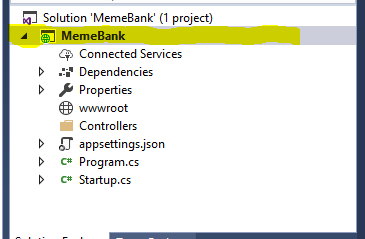
  * Name it Models.
  * Right click and Add new Item - Class. Name it whatever you're modeling. In this case our model is of a meme object, so we'll call it MemeItem.class
* Now within the inner curly braces we'll paste our code from json2csharp.com Note - we dont want to copy `public class RootObject` or the curly braces

It should look something like:
```
using System;
using System.Collections.Generic;
using System.Linq;
using System.Threading.Tasks;

namespace MemeBank.Models
{
    public class MemeItem
    {
        public int Id { get; set; }
        public string Title { get; set; }
        public string Url { get; set; }
        public string Tags { get; set; }
        public string Uploaded { get; set; }
        public string Width { get; set; }
        public string Height { get; set; }
    }
}
```

Now on to the magic! As this is an MVC project, we have something called Scaffolding to our disposal. Essentially what this is, is we can specify how the database is to be used (ie our model) and we can let the framework generate (or scaffold) boilerplate code for basic CRUD operations and the db context.

Right click on the Controllers folder - Add -> new scaffolded Item. Select API (on the left) then select "API Controller with actions, using Entity Framework". Press Add

In the model class, select the model we just added (MemeItem) It will auto populate the controller name. Change this to MemeController. Finally for Data context class, press the plus button and select Add. Press Add again.
<br/>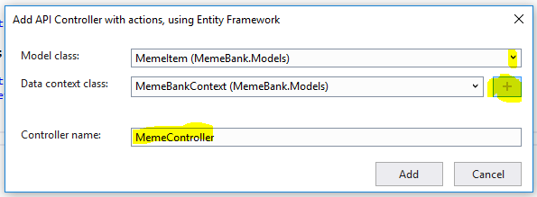

This does two main things. It add a MemeItemsController - this specifies the CRUD operations for our API - more on this later.

It also creates a MemeBankContext which is essentially the bridge between your entity classes and the database.

We've just created the bare bones, but there is onething we need to do before the bare bones are useable. If we run the project now, youll note it opens  `https://localhost:44382/api/values` or similar and shows an error. This is because we deleted the valuescontroller so we need to update this. Under Properties in the solution explorer there is a file called **launchSettings.json**. You'll note a field called "launchUrl". We need to change this to our controller name. In this case its meme.

If you run it now you'll see a blank page in the browser, with the updated url `https://localhost:44382/api/meme`.

### 4. Enabling Sqlite

On to the database side of things. With our current project it uses sql server, but this can be pricy when hosting on a cloud service provider. We'll get around this by using Sqlite. Sqlite is a library that implements a self-contained, serverless, zero-configuration, transactional SQL database engine. Free database sound too good? It is - there are limitations with scaling so dont use this approach for production implementations (but itll be perfect for this tutorial).

We'll need to add Sqlite support by adding a NuGet Package (Essentially a library). To do this, in Visual Studio right click your Solution in Solution Explorer and select Manage NuGet Pakages for Solution...

In the opened tab, select Browse, and paste `Microsoft.EntityFrameworkCore.Sqlite` in the search bar. 
<br/>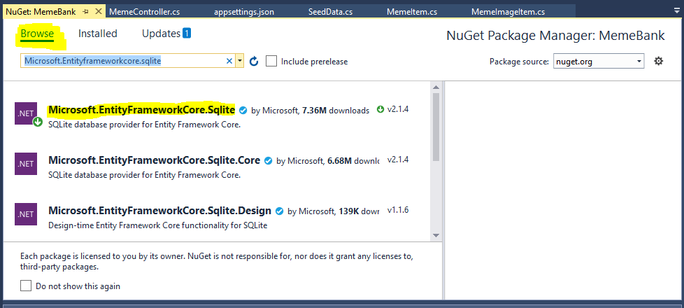

Click the Package, check the tick box in for your project and click the install button. select I Agree and wait for the package to install.

Now we need to configure our database. In **startup.cs**, there is a method called ConfigureServices, with the following line
```
 services.AddDbContext<MemeBankContext>(options =>
                    options.UseSqlServer(Configuration.GetConnectionString("MemeBankContext")));
```
**Lets change this to use useSqlite.**

```
services.AddDbContext<MemeBankContext>(options =>
                    options.UseSqlite(Configuration.GetConnectionString("MemeBankContext")));
```

We also need to change the MemeBankContext. This is currently configured to a local sql server instance, but we need to change this to use sqlite. Go to **appsettings.json** and change the MemeBankContext to (or whatever you want to call your database file)

```
 "ConnectionStrings": {
        "MemeBankContext": "Data Source=Meme.db"
    }
```


#### Migrations & Seed Data
Normally when using something like sql server, we specify tables and columns within it in terms of how the data is structured for storage. However for Sqlite we need to define this through seed data (we initialise the database by specifying how it looks). To do this, create a new class in your Model folder name SeedData.cs and paste the following:

```
using System;
using System.Collections.Generic;
using System.Linq;
using System.Threading.Tasks;

namespace MemeBank.Models
{
    public static class SeedData
    {
        public static void Initialize(IServiceProvider serviceProvider)
        {
            using (var context = new MemeBankContext(
                serviceProvider.GetRequiredService<DbContextOptions<MemeBankContext>>()))
            {
                // Look for any movies.
                if (context.MemeItem.Count() > 0)
                {
                    return;   // DB has been seeded
                }

                context.MemeItem.AddRange(
                    new MemeItem
                    {
                        Title = "Is Mayo an Instrument?",
                        Url = "https://i.kym-cdn.com/photos/images/original/001/371/723/be6.jpg",
                        Tags = "spongebob",
                        Uploaded = "07-10-18 4:20T18:25:43.511Z",
                        Width = "768",
                        Height = "432"
                    }


                );
                context.SaveChanges();
            }
        }
    }
}


```
Youll note there are some red error lines after pasting. Click on GetRequiredService and a light bulb with a cross should appear.
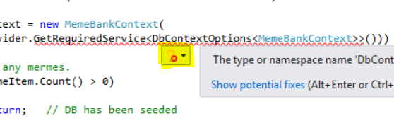
 Clicking on this will suggest fixes for the error. In this case we can select the first suggestion. This is occur twice and add the follow namespaces to the top of the file:
```
using Microsoft.EntityFrameworkCore;
using Microsoft.Extensions.DependencyInjection;
```
Basically what this does is it adds the columns we need by adding in a dummy entry if there arent any entries in our database.

Now we need to check if there is seed data on start up and add it if its not present. Replace the Main method in the program.cs file with:

```
 public static void Main(string[] args)
        {
            var host = CreateWebHostBuilder(args).Build();

            using (var scope = host.Services.CreateScope())
            {
                var services = scope.ServiceProvider;

                try
                {
                    var context = services.GetRequiredService<MemeBankContext>();
                    context.Database.Migrate();
                    SeedData.Initialize(services);
                }
                catch (Exception ex)
                {
                    var logger = services.GetRequiredService<ILogger<Program>>();
                    logger.LogError(ex, "An error occurred seeding the DB.");
                }
            }

            host.Run();
        }

```

Before we run our project, we also need to create the database. First we need to run an initial migration and then apply the migration to create the schema.

Open command prompt to the root folder of your project and run the following commands:

```
dotnet ef migrations add InitialCreate
```
Then
```
dotnet ef database update
```

Now lets run our solution. the browser should return your seed data as below:
```
[{"id":1,"title":"Is Mayo an Instrument?","url":"https://i.kym-cdn.com/photos/images/original/001/371/723/be6.jpg","tags":"spongebob","uploaded":"07-10-18 4:20T18:25:43.511Z","width":"768","height":"432"}]
```

Nice, your database is ready for use.


5. CRUD + Swagger

What's CRUD? From wiki... " create, read, update, and delete (CRUD) are the four basic functions of persistent storage."

These are operations which you want to do against your API. Belive it or not, your api is already doing the above - its in our controller. When using the browser we are doing the read part of CRUD. So how do you do the other operations. There are two options - postman or swagger (or both). Ill go through swagger here. Swagger is a tool which we can use to both document and interate with our API.

To add it, we need to add its NuGet package to our Solution. Its called `Swashbuckle.AspNetCore`

Next add the following code to the bottom of the ConfigureServices method:

```
            // Register the Swagger generator, defining 1 or more Swagger documents
            services.AddSwaggerGen(c =>
            {
                c.SwaggerDoc("v1", new Info { Title = "MemeBank", Version = "v1" });
            });

```

Next add the following to the **Configure method** in **startup.cs** file.

```
 // Enable middleware to serve generated Swagger as a JSON endpoint.
    app.UseSwagger();

    // Enable middleware to serve swagger-ui (HTML, JS, CSS, etc.), 
    // specifying the Swagger JSON endpoint.
    app.UseSwaggerUI(c =>
    {
        c.SwaggerEndpoint("/swagger/v1/swagger.json", "My API V1");
        c.RoutePrefix = string.Empty; // launch swagger from root
    });

```

Now back in launchSettings.json, change `"launchUrl": "api/meme"` to `"launchUrl": ""`. This will open root when we launch our project, which is what we have configured swagger to run from.

Here you will see a bunch of coloured retangles. Each relate to a CRUD operation

Create: POST
Read: GET
Update: PUT
Delete: DELETE

If you click on GET, "Try it out" -> execute, youll see your seed data being return - just a bit more readable. Swagger also allows you to add, edit, and delete data through its webpage too which is handy.

## 6. LINQ

Whats LINQ? It stands for Language Integrated Query. Essentially it allows you to express queries in Microsoft Languages. It allows you to write queries without worrying about how the query will be executed. We will use it to query our Sqlite database.

As we want to be able to search by tags, we will want to firstly create a new api endpoint to search by tag. Then in our code we will want to return the list.

We add this code change in our controller as below:

```
// GET: api/Meme/Tags
        [Route("tags")]
        [HttpGet]
        public async Task<List<string>> GetTags()
        {
            var memes = (from m in _context.MemeItem
                        select m.Tags).Distinct();

            var returned = await memes.ToListAsync();

            return returned;
        }
```

<br/>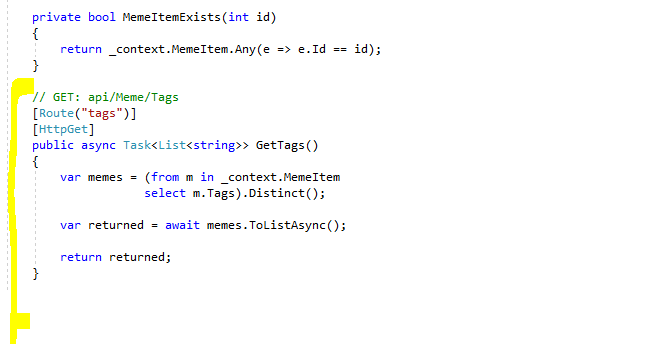

The LINQ is ` var memes = (from m in _context.MemeItem select m.Tags).Distinct();` For those familiar with SQL, it has some similiarities. Basically from our list of meme items we want all the distinct tags.

So how do we search by meme tag? There are a couple things we need to do. Firstly, its a new endpoint, so we need a new method to add. As we will be specifying what tag to search, we need to accept it as a parameter. Finally, we need to a) get all the items, then b) return all the items which match the requested tag. Then we need to return the list. 

```
        // GET: api/Meme/Tags
        
        [HttpGet]
        [Route("tag")]
        public async Task<List<MemeItem>> GetTagsItem( [FromQuery] string tags)
        {
            var memes = from m in _context.MemeItem
                         select m; //get all the memes


            if (!String.IsNullOrEmpty(tags)) //make sure user gave a tag to search
            {
                memes = memes.Where(s => s.Tags.ToLower().Equals(tags.ToLower())); // find the entries with the search tag and reassign
            }

            var returned = await memes.ToListAsync(); //return the memes

            return returned;
        }

```
<br/>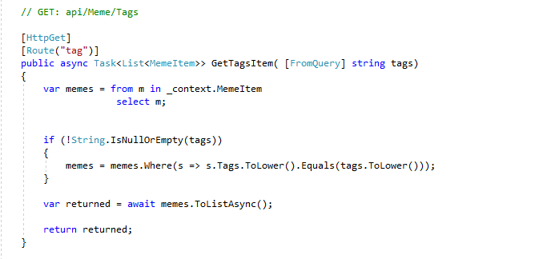

### 7. Blob Storage

Due to the performance hit, its normally best to store images in a filesystem rather than the database itself. In order for us to do this we will be using Azure Blob Storage and will be storing the file path to the uploaded image in our database.

To create blob storage, head over to portal.azure.com and create a new resource search for "Storage account - blob, file, table, queue"

Click create and fill in the details. Some things to note, local storage name needs to be unique. For location its best to choose Austrailia Southeast as its closer to us, and account kind as blob. Click review and create.
<br/>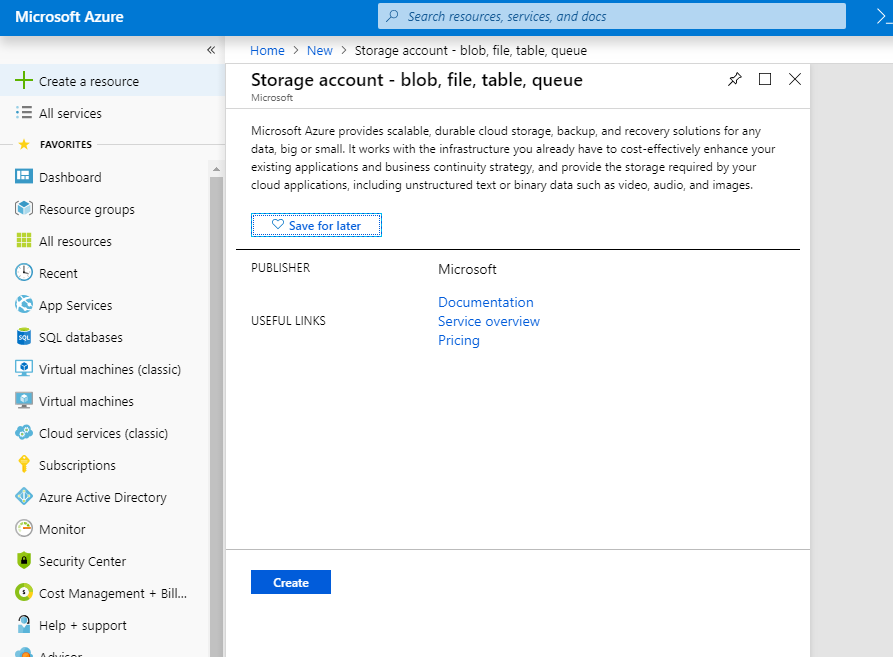
<br/>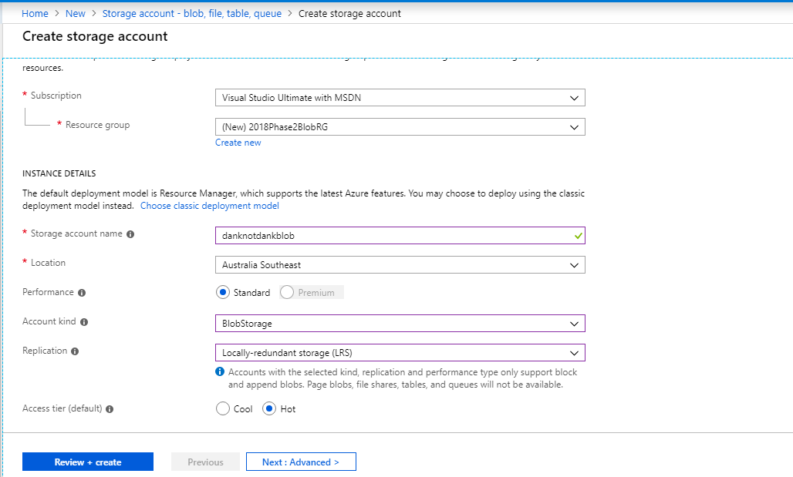

Once created, click on "Go to Resource" and click on "Blobs" as per below.


We need to create a container, which is like a logical grouping, for our images. Click on create and name your container images. Set the public access level to Container.

<br/>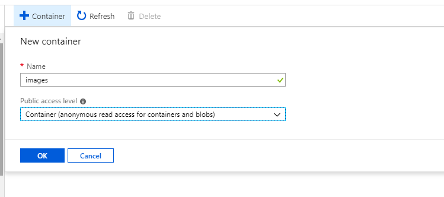

Press the cross on thr right to close the container screen. On the left inner side menu there is a row with "Access Keys".

<br/>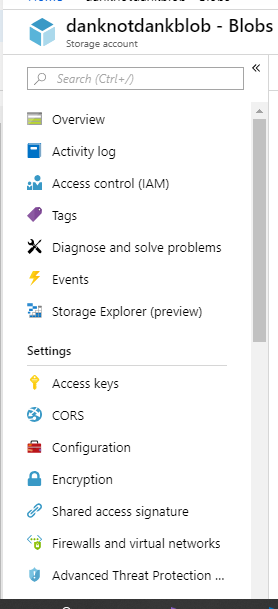

 Click on this and store all five fields. Ensure you keep the keys seperate. We will need to use this in our API.

<br/>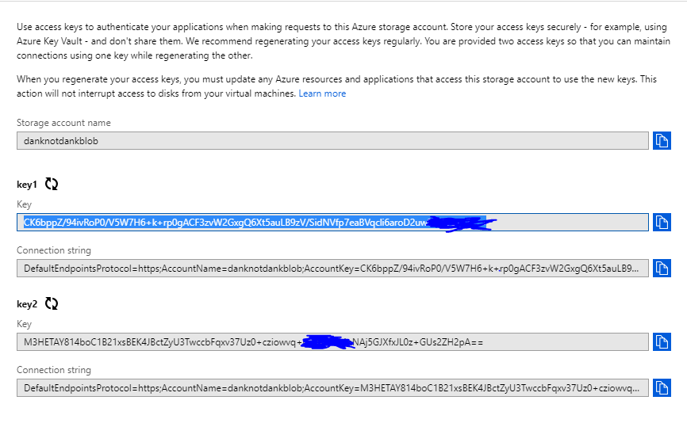

We've created our blob storage, now we need to edit our api to receive images and send them to our blob storage.

first we need to add the client library for our api to work with the blob storage. For this add the **WindowsAzure.Storage NuGet Package**.

We need to model what our request will look like. When uploading images, we will be sending the image title, image tag, and the image itself. For our  API to know what it is we need to create a new class in our Model folder. Right click the model folder and add item -> class. Name it MemeImageItem.cs

Lets add the three above properties to this class. It should look like:

```
using Microsoft.AspNetCore.Http;
using System;
using System.Collections.Generic;
using System.Linq;
using System.Threading.Tasks;

namespace MemeBank.Models
{
    public class MemeImageItem
    {
        public string Title { get; set; }
        public string Tags { get; set; }
        public IFormFile Image { get; set; }
    }
}
```

If you get a red line under IFormFile, remember visual studio provides recommended fixes.

After creating our model, we need to modify our MemeController to handle image requests. Remember back to our CRUD section above, as we want to create a entry into our database, we want to use the the POST method.

Add the following piece of code below the GetTags method. We will need to fix the red error lines. Instructions for this below the code snippet. 

Essentially what this does is it takes the request, ensures its the correct type. It then reads the image, uploads it to our blob storage container. If its successfully uploaded, we add the entry into our Sqlite database (the title, tag, image url, upload date, and we work out the image sizes based off the image). We then save the entry into our database and return a success message to the uploader.

```
 [HttpPost, Route("upload")]
        public async Task<IActionResult> UploadFile([FromForm]MemeImageItem meme)
        {
            if (!MultipartRequestHelper.IsMultipartContentType(Request.ContentType))
            {
                return BadRequest($"Expected a multipart request, but got {Request.ContentType}");
            }
            try
            {
                using (var stream = meme.Image.OpenReadStream())
                {
                    var cloudBlock = await UploadToBlob(meme.Image.FileName, null, stream);
                    //// Retrieve the filename of the file you have uploaded
                    //var filename = provider.FileData.FirstOrDefault()?.LocalFileName;
                    if (string.IsNullOrEmpty(cloudBlock.StorageUri.ToString()))
                    {
                        return BadRequest("An error has occured while uploading your file. Please try again.");
                    }

                    MemeItem memeItem = new MemeItem();
                    memeItem.Title = meme.Title;
                    memeItem.Tags = meme.Tags;

                    System.Drawing.Image image = System.Drawing.Image.FromStream(stream);
                    memeItem.Height = image.Height.ToString();
                    memeItem.Width = image.Width.ToString();
                    memeItem.Url = cloudBlock.SnapshotQualifiedUri.AbsoluteUri;
                    memeItem.Uploaded = DateTime.Now.ToString();

                    _context.MemeItem.Add(memeItem);
                    await _context.SaveChangesAsync();

                    return Ok($"File: {meme.Title} has successfully uploaded");
                }
            }
            catch (Exception ex)
            {
                return BadRequest($"An error has occured. Details: {ex.Message}");
            }


        }

        private async Task<CloudBlockBlob> UploadToBlob(string filename, byte[] imageBuffer = null, System.IO.Stream stream = null)
        {

            var accountName = _configuration["AzureBlob:name"];
            var accountKey = _configuration["AzureBlob:key"]; ;
            var storageAccount = new CloudStorageAccount(new StorageCredentials(accountName, accountKey), true);
            CloudBlobClient blobClient = storageAccount.CreateCloudBlobClient();

            CloudBlobContainer imagesContainer = blobClient.GetContainerReference("images");

            string storageConnectionString = _configuration["AzureBlob:connectionString"];

            // Check whether the connection string can be parsed.
            if (CloudStorageAccount.TryParse(storageConnectionString, out storageAccount))
            {
                try
                {
                    // Generate a new filename for every new blob
                    var fileName = Guid.NewGuid().ToString();
                    fileName += GetFileExtention(filename);

                    // Get a reference to the blob address, then upload the file to the blob.
                    CloudBlockBlob cloudBlockBlob = imagesContainer.GetBlockBlobReference(fileName);

                    if (stream != null)
                    {                       
                        await cloudBlockBlob.UploadFromStreamAsync(stream);
                    }
                    else
                    {
                        return new CloudBlockBlob(new Uri(""));
                    }

                    return cloudBlockBlob;
                }
                catch (StorageException ex)
                {
                    return new CloudBlockBlob(new Uri(""));
                }
            }
            else
            {
                return new CloudBlockBlob(new Uri(""));
            }

        }

        private string GetFileExtention(string fileName)
        {
            if (!fileName.Contains("."))
                return ""; //no extension
            else
            {
                var extentionList = fileName.Split('.');
                return "." + extentionList.Last(); //assumes last item is the extension 
            }
        }

```

The first error is for : MultipartRequestHelper. Let create a new folder (like we did for Model folder) called Helpers. Add new class MultipartRequestHelper in this folder and paste the following code.

```
using System;
using System.IO;
using Microsoft.Net.Http.Headers;

namespace MemeBank.Helpers
{
    public static class MultipartRequestHelper
    {
        // Content-Type: multipart/form-data; boundary="----WebKitFormBoundarymx2fSWqWSd0OxQqq"
        // The spec says 70 characters is a reasonable limit.
        public static string GetBoundary(MediaTypeHeaderValue contentType, int lengthLimit)
        {
            var boundary = HeaderUtilities.RemoveQuotes(contentType.Boundary);
            if (string.IsNullOrWhiteSpace(boundary.ToString()))
            {
                throw new InvalidDataException("Missing content-type boundary.");
            }

            if (boundary.Length > lengthLimit)
            {
                throw new InvalidDataException(
                    $"Multipart boundary length limit {lengthLimit} exceeded.");
            }

            return boundary.ToString();
        }

        public static bool IsMultipartContentType(string contentType)
        {
            return !string.IsNullOrEmpty(contentType)
                   && contentType.Contains("multipart/", StringComparison.OrdinalIgnoreCase);
        }

        public static bool HasFormDataContentDisposition(ContentDispositionHeaderValue contentDisposition)
        {
            // Content-Disposition: form-data; name="key";
            return contentDisposition != null
                   && contentDisposition.DispositionType.Equals("form-data")
                   && string.IsNullOrEmpty(contentDisposition.FileName.ToString())
                   && string.IsNullOrEmpty(contentDisposition.FileNameStar.ToString());
        }

        public static bool HasFileContentDisposition(ContentDispositionHeaderValue contentDisposition)
        {
            // Content-Disposition: form-data; name="myfile1"; filename="Misc 002.jpg"
            return contentDisposition != null
                   && contentDisposition.DispositionType.Equals("form-data")
                   && (!string.IsNullOrEmpty(contentDisposition.FileName.ToString())
                       || !string.IsNullOrEmpty(contentDisposition.FileNameStar.ToString()));
        }
    }
}
```
This ensures we have the right content type in the request.

Back in the controller class, we will need to add its namespace. This can be done with the yellow light bulb which pops up on clicking the red line.

The next error is for System.Drawing.Image. We will need to add a NuGet package for this. It is called system.drawing.common. This should fix the error.

The next error is for CloudBlockBlob. Selecting on the first suggestion fixes this error (adds the namespace).

Next we need to add those blob storage keys and properties.

In appsettings.json, add the following (including the initial comma):

```
,
    "AzureBlob": {
        "name": "",
        "key": "",
        "connectionString": ""
    }
```
In name add your storage account name (in our example danknotdankblob). For key, add key 1's key. For connectionString, add key 1's connection string.

In our example it will look something like:
```
,
    "AzureBlob": {
        "name": "danknotdankblob",
        "key": "CK6bppZ/94ivRoP0/V5W7H6+k+rp0gACF3zvW2GxgQ6Xt5auLB9zV/SidNVfp7eaBVqc",
        "connectionString": "DefaultEndpointsProtocol=https;AccountName=danknotdankblob;AccountKey=CK6bppZ/94ivRoP0/V5W7H+auLB9zV/SidNVfp7eaBVqcli6aroD2uwEmTTGZLA==;EndpointSuffix=core.windows.net"
    }
```

Now we need to use these keys in our MemeController. Under the line `private readonly MemeBankContext _context;` add the following line:
```
private IConfiguration _configuration;
```

Update the constructor to (and fix the error line of IConfiguration as per suggestion): 
```
public MemeController(MemeBankContext context, IConfiguration configuration)
        {
            _context = context;
            _configuration = configuration;
        }
```

For CloudStorageAccount, and StorageCredentials use the Visual Studio suggestion.

All the errors should be fixed now. Run the solution.

Try out the new post endpoint on swagger and upload a photo. It should be successful. If you then execute the Get endpoint, your newly uploaded photo should be the last entry.

Congrats you've got a working API which uploads photos (or memes in our case)!

There is one last thing to do...

### 8. Deploying to Azure

We have been running our API locally. This means it cant be access on the internet. We will need to deploy this as a web app on azure which will place it on the internet.

To do this go to portal.azure.com and create a new resource and select web app.

<br/>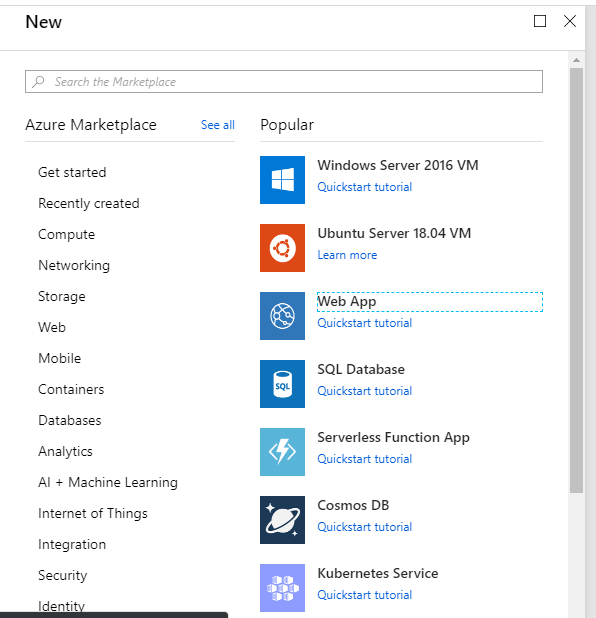
 Enter an app name (it must be unique) and select create.
<br/>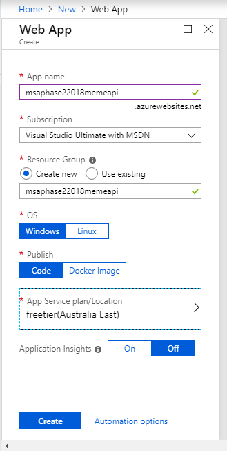

Once created go to the resource.

On the inner left menu select deployment center. 
<br/>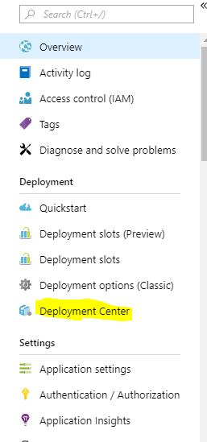

Select github (here's hoping you've been committing to github!) Select continue. 
<br/>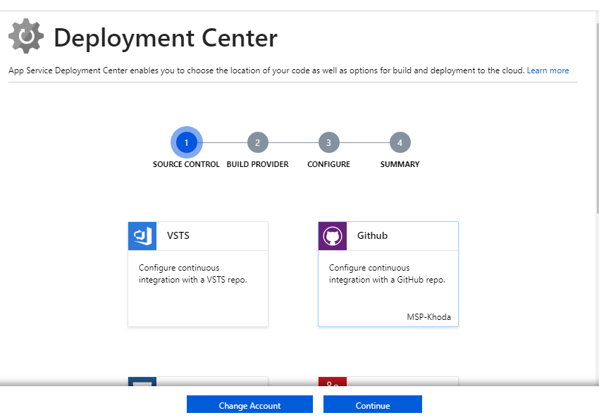

On the following screen select App Service Kudu build server. Select continue. 

<br/>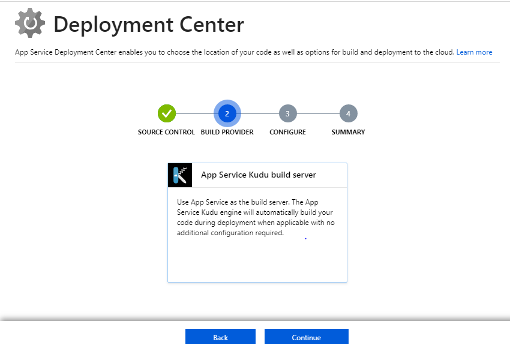
Add in your branch and repo details. Select continue. Finally hit finish and wait for the deployment to finish running.

<br/>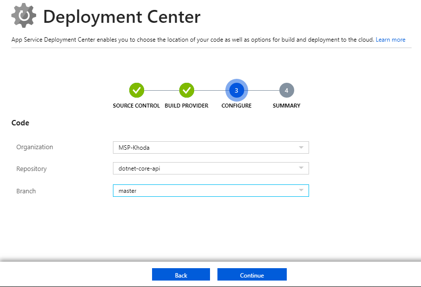
<br/>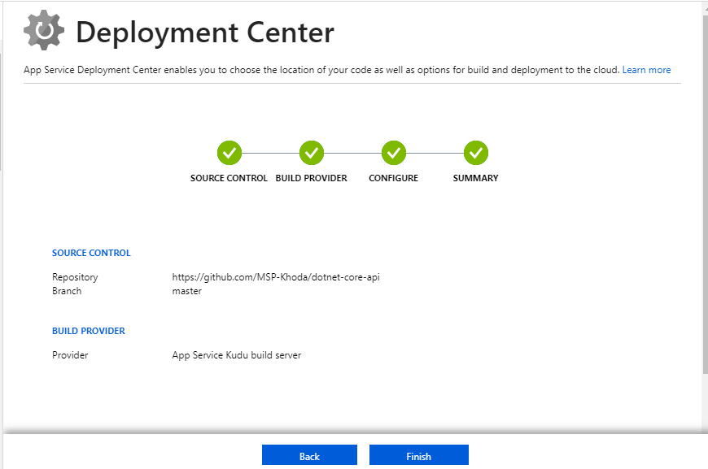

You api should now be hosted! (You can find the url on the overview page of the webapp).

<br/>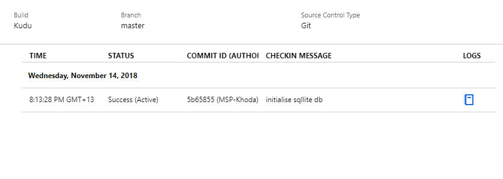

Congrats you now have a working API on the internet!

### 9. CORS Warning/Error
You will likely receieve a CORS error/warning if you attempt to use your newly published api in your web app front end. Cross-origin resource sharing (CORS) is a mechanism that allows restricted resources on a web page to be requested from another domain outside the domain from which the first resource was served. As your API and front end are hosted on different sites/urls, we need to enable CORS. You can be specific to only enable localhost and the url which you publish your front end, or you can allow any URL to access it. For this workshop we will enable all URLS to call our api. 

In order to do this, we must go to the Azure portal and open the app service which our API is published on. Once there, on the inner left menu scroll down to the menu item CORS. Once opened, there will be an empty text box. Enter '*' (without the quotes). This will enable all the URLs. Now press save at the top. The CORS warning should now be gone.
<br/>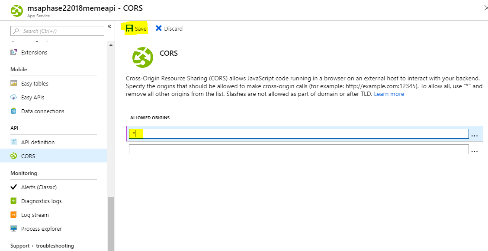