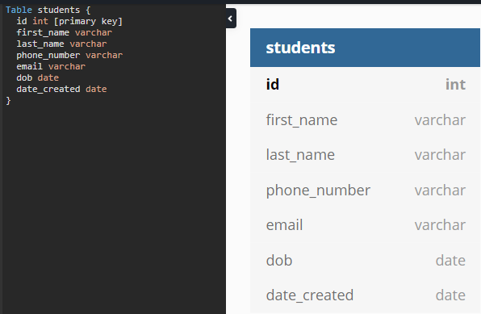
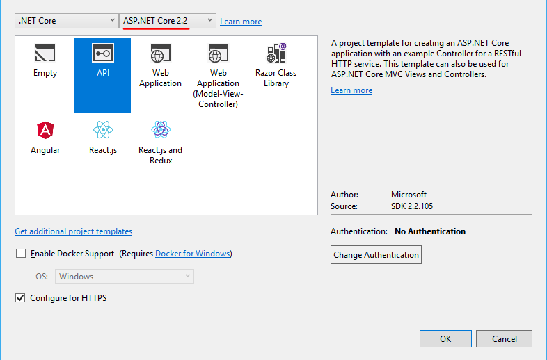

# Creating Database and API

This documentation is a supplement to the YouTube Video on how to create a Database on Azure and an API on ASP.NET Core. If you are confident with your ability to code, feel free to watch the video in 2x speed or just read the documentation by itself. :)

### Contents
1. Before you start
   * 1.1 Context
2. Model
3. Azure SQL Database
4. Create the API using .NET Core
5. Swagger
6. Submission Criteria

## 1. Before you start 

There are a few programs you will need to have installed prior to commencing this tutorial.

* <a href="https://visualstudio.microsoft.com/downloads/">Visual Studio Community 2017</a>
    * When installing ensure ASP.NET and Web development is selected      
* <a href="https://dotnet.microsoft.com/download/visual-studio-sdks">.NET Core 2.2 SDK</a>
* Azure Account with active subscription, if you don't already have one, sign up with your uni account to get a free subscription.
* <a href="https://docs.microsoft.com/en-us/cli/azure/install-azure-cli?view=azure-cli-latest">Azure command line (CLI)</a>
* Don't forget to restart your computer after you've installed all the softwares


## 1.1 Context

For this tutorial, we will be making a school student management system(SIS) RESTful API that allows the users to create/read/update/delete student information. 

## 2. Model

Before we even start to write a line of code, we need to think about what we would like to store in our database and what properties we want our API to return. This is crucial because the cost of modifying an existing database is very high.

In phase 1 we will only focus on creating one table, keep an eye out on phase 2 for more exciting stuff such as database normalisation concepts and relational models!
 
 In this example, we would like to store some details of the student. Ask yourself, what basic information would we need to store from a student?

 We will be storing the following information, feel free to add/delete fields as you see fit. **You will be required to add at least one field in order to pass this assignment**

 * Id
 * First Name
 * Last Name
 * Phone Number
 * Email Address
 * DOB (Date of birth)
 * Date Created

 Aside from field names, we also need to consider their types. For example, it is normal to store *id* as integers, but it doesn't make sense to only allow numbers to be stored in the *name* fields. 
 
There are many data types available in SQL, the ones we will be using are:
 * VARCHAR
 * INT
 * DATE

 >You can read more about data types on 
 https://www.w3schools.com/sql/sql_datatypes.asp

 After we confirm on what we need to store, we shall model this out. 

 <br/>

  Notice how there is the word 'primary key' in the id field?
  >A primary key is a special relational database table column designated to uniquely identify a record.
  A primary key’s main features are:
  It must contain a unique value for each row of data.
  It cannot contain null values.
---
**NOTE**

This diagram may look redundant/hollow as of now because there is only one table, but creating the diagram before you code will really benefit you when you have many relational models which would get heinously complicated very quickly.

---

Noticed how the fields have the same naming convention? Each word is separated with a underscore and there are no capital letters. Having the same naming convention would add consistency throughout the database.

## 3. Azure SQL Database
Now that we have finished planning for the database, we can actually create it on Azure portal!

Make sure you have an active subscription, navigate to https://portal.azure.com on your browser and search for a new service resource called "SQL databases"
  <br/>

  Then click on Add then follow the structure below
  <br/>

  When you are creating a new server, choose a sensible server name and note down your database admin login and password, we will need to use it later. Choose Australis Southeast Location as it is physically closest to us.
  <br/>

  When it comes to choosing Compute + storage, select the free/cheapest option
  <br/>

  When you are done, click on Review + create then your deployment should be underway!

  In about 2 minutes, you should see the following notification
  <br/>

  Now that the database is created, we shall create the table we've designed earlier in the database. Click on your new SQL Database resource
  <br/>

  From the tool bar on the left, choose Query Editor.
  <br/>
  
  Remember your database admin login and password? Pop those in.

  We are now going to use standard SQL statement to create a new table (notice how similar this SQL statement is compared to the design we did on dbDiagram?):
  ```
    CREATE TABLE [students]
    (
        id INT NOT NULL IDENTITY(1, 1) PRIMARY KEY,
        first_name VARCHAR(50),
        last_name VARCHAR(50),
        phone_number VARCHAR(20),
        email VARCHAR(50),
        dob DATE,
        date_created DATE
    );
  ```

  Hit the Run button then you should see the following message:
  <br/>

  Our database is basically done. We just need to do two more things to allow us to access the database from anywhere.

  Go back to Overview and hit "Set server firewall"
  <br/>
  Add the following firewall rule to enable access to the database from any IP address.
  <br/>
  Then hit Save.

  One more thing. 
  Choose Connection Strings from the toolbar and copy ADO.NET connection string, we will use this to scaffold the database when we are creating the API.
  <br/>

  Now we are ready to go to the next phase.

  ## 4. Create the API using .NET Core

  ### Creating the base project
  Open Visual Studio -> New Project -> Web -> .Net Core -> ASP.NET Core Web Application. 
  <br/>Make sure you tick add to source control.

  <br/>

  Select API and make sure your .Net Core version is 2.2
  If you only see ASP.NET COre 2.1, download the ASP.NET Core 2.2 SDK as suggested in the beginning of the documentation.

  <br/>

  Once you hit OK, your project should be created. We now need to install a few dependencies so we can work with our SQL Server Database.
  Navigate to the search bar on the top right and search for "NuGet" then select manage NuGet package

  <br/>

  Click on Browse and search for
  ``` Microsoft.EntityFrameworkCore.SqlServer ```

  <br/>

  Hit install then do the same for  ``` Microsoft.EntityFrameworkCore.Design ```

  We have everything we need to work with the database, now we can "Scaffold" the database.
  > ASP.NET **Scaffolding** is a code generation framework for ASP.NET Web applications. You add scaffolding to your project when you want to quickly add code that interacts with data models. Using scaffolding can reduce the amount of time to develop standard data operations in your project.
  
  Open up Package Manager Console. (If you can't find it, remember to use the search bar on the top right) 
  ```
  Scaffold-DbContext "YOURCONNECTIONSTRING" Microsoft.EntityFrameworkCore.SqlServer -OutputDir Model -Context "CONTEXTNAME" -DataAnnotations
  ```
  Replace **YOURCONNECTIONSTRING** with the connection string you've retrieved from Azure.<br/>
  Replace **CONTEXTNAME** with your database name you've retrieved from Azure, in this case I will name it schoolSIMSContext<br/>
  Paste the code in the console and execute it.

  In the Solution Explorer, you can see that there are two files being created through the scaffold command.
  
  ```schoolSISContext.cs``` represents a session with the underlying database. You can read more on <a href="https://docs.microsoft.com/en-us/dotnet/api/system.data.entity.dbcontext?view=entity-framework-6.2.0">DbContext Class</a>

  ```Students.cs``` is the class created from the design of the database table, think of it like the blueprint for a student object. Whenever we create a student, it will have those fields/variables listed in the Students class.

  We now have the blueprint for a student, we can use this blueprint to create a controller so we can interact with the database with HTTP requests. <a href="https://docs.microsoft.com/en-us/aspnet/web-api/overview/getting-started-with-aspnet-web-api/tutorial-your-first-web-api#adding-a-controller">Read more about controllers here</a>

  Right click on controllers from the Solution Explorer - ```Add - New Scaffold item...```

  <br/><br/>

  Choose ```API Controller with actions, using Entity Framework```
  <br/><br/>

  Choose Students in Model class, schoolSISContext as Data context class and controller name should be auto completed.

  <br/><br/>

  Hit add and wait for Visual Studio to do its magic.

  Once done, you should notice the new file ```StudentsControllers.cs```
  This controller allows us to Create/Read/Update/Delete (This is called CRUD, the four basic functions of persistent storage) students from the database.

  The API is almost done! Now we need to change the connection string so we can access the database with our credentials on Azure.<br/>
  Open ```appsettings.json``` from the Solution Explorer and change the value of the context key to your connection string you've retrieved from Azure.
  ```
  {
    "Logging": {
        "LogLevel": {
        "Default": "Warning"
        }
    },
    "AllowedHosts": "*",
    "ConnectionStrings": {
        "schoolSISContext" : "YOURCONNECTIONSTRING"
    }
  }
  ```

  Our last step is to change ConfigureServices method in `startup.cs`.

  Add these two dependencies in `Startup.cs`
  ```
  using Microsoft.EntityFrameworkCore;
  using schoolSIMS.Model;
  ```

  Under the ConfigureServices() Method, add the following line

  ```
  var connection = Configuration.GetConnectionString("schoolSIMSContext");
  services.AddDbContext<schoolSIMSContext>(options => options.UseSqlServer(connection));
  ```

  This would add the `schoolSIMSContext` to the application so our Student controller can use it.

  With that last change, Go ahead and start the API application with IIS Express in the tool bar. 
  <br/></br>
  Once IIS Express launches a browser, change the path from /values to /Students
  <br/><br/>
  **Voilà, this is your first API!** This is not very exciting right now as there is no content stored in the database, but if you are able to see this, believe it or not, you've just created a fully functional API.

  ## 5. Swagger UI
  In order for us to interact with the API, we can use <a href="https://www.getpostman.com/">Postman</a> to make HTTPS requests, but that's boring and abstract when we are just starting out creating API. In order to have a visual representation of the API, let's install <a href="https://swagger.io/">Swagger</a>

  > Swagger helps developers design, build, document, and consume RESTful Web services.

  Open Manage NuGet packages from Visual studio as before, go to Browser and search for `Swashbuckle.AspNetCore` and hit install.
  <br/><br/>

  Then add the following code to the bottom of the ConfigureServices method in ``Startup.cs``:

  ```
    // Register the Swagger generator, defining 1 or more Swagger documents
    services.AddSwaggerGen(c =>
    {
        c.SwaggerDoc("v1", new Info { Title = "TITLE", Version = "v1" });
    });
  ```

  Next add the following to the ``Configure`` method in ``startup.cs`` file.

  ```
    // Enable middleware to serve generated Swagger as a JSON endpoint.
    app.UseSwagger();

    // Enable middleware to serve swagger-ui (HTML, JS, CSS, etc.), 
    // specifying the Swagger JSON endpoint.
    app.UseSwaggerUI(c =>
    {
        c.SwaggerEndpoint("/swagger/v1/swagger.json", "My first API V1");
        c.RoutePrefix = string.Empty; // launch swagger from root
    });
  ```
  Now your ``startup.cs`` file should look like this
  <br/><br/>

  The last step before seeing an Swagger UI for the API is to edit the launch path.
  Go to Properties in the Solution Explorer and open `launchSettings.json`.
  Change all occurrences of 
  ```
   "launchUrl": "api/Values"
  ```
  to 
  ```
   "launchUrl": ""
  ```
  This will open up Swagger UI when we launch our project.
  
  Everything is ready. Launch the project again to see your new Swagger UI!

  <br/><br/>

  Let's create our very first student using the Swagger UI.
  Click on POST under Students controller

  >POST is a HTTP method used to send data to a server to create/update a resource

  <br/><br/>

  Click on Try it out and enter the following information:
  ```
  {
    "firstName": "MSA",
    "lastName": "NZ",
    "phoneNumber": "09-3625800",
    "email": "microsoft@microsoft.com",
    "dob": "2019-03-30",
    "dateCreated": "2019-03-30"
  }
  ```
  Then click on execute.

  If you see the status code ```201```, it means that you have just created an entry in your database through your very first API :D

  >The HTTP 201 Created success status response code indicates that the request has succeeded and has led to the creation of a resource.
  
  <br/><br/>

  To see the entry you just created, we need to use the ```GET``` HTTP method. Click on Get under students controller in Swagger UI and then hit execute.

  <br/><br/>

  Notice that there is a Values controller shown in the Swagger UI under Students? That's the default controller the API creates. We can get rid of it simply by deleting ```Controllers/ValuesController.cs``` in Visual Studio.

  ## 6. Submission Criteria:
  1) Screenshots of your SQL Database through Query Editor via Azure Portal 
  2) Screenshots of your Swagger UI showing your RESTful API
  3) Link to your GitHub Repo